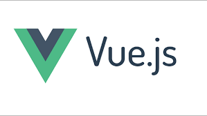

## 
 Gérer des projets, des tâches et communiquer avec Mahsroo 

---

## Gérer des projets, des tâches et communiquer avec Mahsroo

- Mashroo est un outil puissant pour gérer des projets impliquant plusieurs personnes de métiers différents. Contrairement à des logiciels complexes comme Microsoft Project, Clarizen ou Redmine, Mashroo convient aussi bien aux développeurs, qu'aux marketeurs, aux créatifs, aux financiers et aux concepteurs.

- Mashroo permet de créer des projets rapidement en partant de modèles de projets, de constituer une équipe qui collaborera ensemble et créer des tâches attribuées aux collaborateurs. Il est également possible de mentionner ses collaborateurs dans les commentaires pour qu'ils reçoivent une notification dans leur boite de réception.

- Tous les fichiers et les communications relatifs à un projet sont synchronisés en un seul endroit facilitant le partage de savoir, la recherche d'informations et ainsi la visibilité. Chaque collaborateur dispose d'une vision claire des tâches en cours et futures mais peut aussi les re-prioriser facilement par glisser-déposer.
Voir l'avancée des projets avec les plannings et les Gantt

- Les plannings et diagrammes de Gantt permettent de comprendre instantanément l'avancement du projet dans le but de prendre des décisions rapidement.

- Enfin, Mashroo ne bouleverse pas les habitudes des salariés car il s'intègre parfaitement dans votre environnement informatique existant. Vous disposez de manière native de connecteurs avec Salesforce, Hubspot, Google Apps, DropBox, Zapier, Zendesk et bien plus.
Que fait Mashroo que ne font Trello et Asana ?

- Bien que Mashroo soit un outil de gestion de projets et de tâches très simple d'utilisation, il regorge de fonctionnalités qui rendent votre équipe plus productive et vous permet de terminer vos projets à temps. Parmi les fonctionnalités couvertes par Mashroo et non supportées par ses concurrents on compte :

    Des diagrammes de Gantt dynamiques permettant de visualiser le déroulement intégral du projet dans le temps
    Les vues sont plus complètes : le tableau Kanban permet par exemple de visualiser plus d'éléments que Trello
    Le planning est ajusté automatiquement en cas de modification de la date d'échéance d'une tâche
    Il est possible de saisir des notes à plusieurs en temps réel à la manière d'un Google Doc
    Les tableaux de bords offrent une vision stratégique
    Un gestionnaire de documents synchronisé avec Google Doc permet de centraliser toute l'information d'un projet particulier et/ou de l'entreprise.

Avantages de Mashroo

  *  Combine gestion de projet + communication + collaboration
  *  Excellente ergonomie
  *  Prix très attractif
  *  Certifications : GDPR

Démonstration et interface de Mashroo

