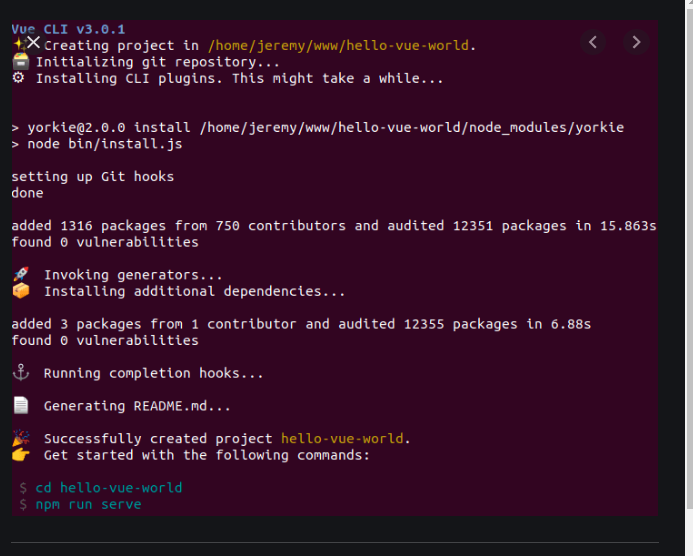
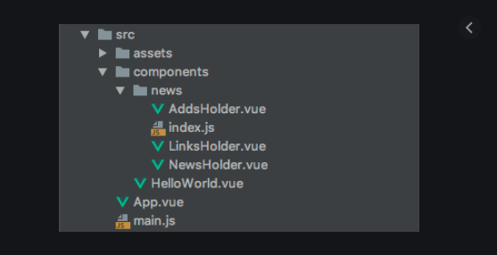

## <center> Framework Vuejs </center>
#### <center> Jump start vue.js </center>

---


- Vuejs les basics
    -  Getting Started
    - The Vue Instance
    - Reactive Data
    - Template Syntax
    - Methods
    - Computed Properties
    - Summary

- les outils vuejs
  -  Why Use Build Tooling?
  -  Vue CLI
  -  Browser Devtools
  -  Editor/IDE Integrations
  -  Summary

- Components :
    - Defining Custom Components
    - Passing Data In
    - Communicating with the Outside World
    - Slots
    - Summary

- Routage :
  - Installing Vue Router
  - Routes
  - Navigation
  - Navigation Guards
  - Example: Authorized Routes
  - Summary

- State Management
    - Installing Vuex
    - Basic Concepts
    - Example
    - Summary

- Nuxt
    - Starting a Nuxt Project
    - Project Layout
    - Nuxt Component Options
    - Building for Production
    - Summary
    -

- Tying It All Together
  - Creating a Nuxt App
  - Adding Authentication
  - Summary


---
<div class="pagebreak"> </div>


### Vuejs les basiques


### Commencer

> On va voir ce qu'on peut faire avec ce frameworks avec un exemple static
>  page web repertoire du  personnes

1.1 A basic Staff directory :


### L'instance Vue

> Pour du prototypage ou de l’apprentissage, nous allon chercher la librairie vue.js du CDN ste .
vous pouvez utiliser la dernière version avec :


```html
<script src="https://cdn.jsdelivr.net/npm/vue/dist/vue.js"></script>

```

> pour la production, nous vous recommandons de vous figer à une version et un build défini pour éviter les changements non compatibles des nouvelles versions :


```html
<script src="https://cdn.jsdelivr.net/npm/vue@2.6.0"></script>
```


ou une version precise

```html
<script src="https://cdn.jsdelivr.net/npm/vue@2.6.0/dist/vue.js"></script>
```

### Créer une instance de Vue
> nous allons creer une instance vue .

```js
np = new Vue({
  el : "#app"

});
```

> "#app" correspond a id de la zone de la page html de l'instance


### Données réactives

> La propriete data deviens un item object sans lequel le composants ne peut pas fonctionner.
> les valeurs des itemes (Array, Number ..) deviennent Reactive et automatiquement met a jour le rendu.
>

> pour enrichir cette page nous allons lui apporter des données
> via l'instance vue

```js
var vm = new Vue({
  el : "#app",
  employees : [
    {
      'firstName':'Abdel',
      'lastName':'Sadquaoui',
      'photo': 'images/photo1.jpeg',
      'email'; 'abdel2@gmail.com',
      'telephone': '0675441123',
      'service'; 'Informatique',
    },

    {
      'firstName':'Christine',
      'lastName':'Delphin',
      'photo': 'images/photo22.jpeg',
      'email'; 'christine.delphin@strandcosmeticseurope.com',
      'telephone': '0478129918',
      'service'; 'Informatique',
    },

  ]

});

```
### Template Syntaxe

> maintenant qu'on une instance avec des données, on va voir comment rendons-nous nos données
Vue.js utilise une syntaxe de template basée sur le HTML qui vous permet de lier déclarativement le DOM rendu aux données de l’instance sous-jacente de Vue. Tous les templates de Vue.js sont du HTML valide qui peut être interprété par les navigateurs et les interpréteurs HTML conformes aux spécifications.

Sous le capot, Vue compile les templates en des fonctions de rendus de DOM virtuel. Combiné au système de réactivité, Vue est en mesure de déterminer intelligemment le nombre minimal de composants pour lesquels il faut redéclencher le rendu et d’appliquer le nombre minimal de manipulations au DOM quand l’état de l’application change.


#### Interpolation :
- l'instance :

```js

var vm = new Vue({
  el : "#app",
  data: {
    msg : "Bonjour !",
    prix  : 120,
  }
});

```

- template :
  - **Texte**

    > La forme la plus élémentaire de la liaison de données est l’interpolation de texte en utilisant la syntaxe “Mustache” (les doubles accolades)

    ```js
    <span>Message: {{ msg }}</span>
    ```

  - **Code**
  -
    ```js
    <div id="app">
      <p>le prix est : {{ price * 1.20 }} TTC </span>
    </div>
    ```

  - **Interprétation du HTML**
    -       > Les doubles moustaches interprètent la donnée en tant que texte brut, pas en tant que HTML. Pour afficher réellement du HTML, vous aurez besoin d’utiliser la directive v-htmldirective :

    ```js
      <p>En utilisant les doubles moustaches : {{ rawHtml }}</p>
      <p>En utilisant la directive `v-html` : <span v-html="rawHtml"></span></p>
    ```

  - **Attributs**

    >Les moustaches ne peuvent pas être utilisées à l’intérieur des attributs HTML. À la place utilisez une directive v-bind

    -
```js
<div v-bind:id="dynamicId"> *** </div>
```


### Méthods
> les Méthodes c'est les fonctions de la vuejs que l'on peut rappeler et executer

```js
<div id="app">
  <p>Current status: {{ statusFromId(status) }}</p>
</div>
<script>
  new Vue({
      el: '#app',
      data: {
      status: 2
  },

  methods: {
      statusFromId(id) {
        const status = ({
        0: 'Asleep',
        1: 'Eating',
        2: 'Learning Vue'
        })[id];
        return status || 'Unknown status: ' + id;
      }
    }
  });
</script>
```

### Computed Properties (Propriétés calculées)

> Computed properties se presente entre properitée des data object et  methods :
> on peut y acceder comme une properitée mais specifié comme une fonction.


```html

<div id="app">
<p>Sum of numbers: {{ numberTotal }}</p>
</div>
<script>
    new Vue({
      el: '#app',
      data: {
      numbers: [5, 8, 3]
    },

    computed: {
      numberTotal() {
        return numbers.reduce((sum, val) => sum + val);
      }
    }
    });
</script>

```

### Résumé
#### The data object versus methods versus computed properties

| element | Readable | Writable | accepts arguments | computed | cached |
| --- | --- | --- | --- | --- | --- |
| data object | Yes | Yes | No | No | NO |
| Methods | Yes | No | Yes | Yes | No |
| Computed | Yes | Yes | No | Yes | Yes |
|  |  |  |  |  |  |


### Directives :
> At the heart of Vue is a way to display data on the page. This is done using templates.
Normal HTML is embellished using special attributes—known as directives—that we
use to tell Vue what we want to happen and what it should do with the data we’ve
provided it.

```html

<div id="app">
<p v-if="isMorning">Good morning!</p>
<p v-if="isAfternoon">Good afternoon!</p>
<p v-if="isEvening">Good evening!</p>
</div>
<script>
  var hours = new Date().getHours();
  new Vue({
      el: '#app',
      data: {
        isMorning: hours < 12,
        isAfternoon: hours >= 12 && hours < 18,
        isEvening: hours >= 18
    }
  });
</script>

```


####  Autre exemple


```html

<div id="app">
  <p v-if="hours < 12">Good morning!</p>
  <p v-if="hours>= 12 && hours < 18">Good afternoon!</p>
  <p v-if="hours > 18">  Good Evening </p>
</div>

  <script>
    new Vue({
      el: '#app',
      data: {
      hours: new Date().getHours()
      }
    });
  </script>

```
####  Autre exemple avec else

> We can also combine the two, using both directives and interpolation to show some
text only if it is defined or useful. See if you can figure out what the following code
displays on the page and when:

```html

<div id="app">
  <p v-if="path === '/'">You are on the home page</p>
  <p v-else>You're on {{ path }}</p>
</div>

<script>
    new Vue({
      el: '#app',
      data: {
        path: location.pathname
      }
    });
</script>
```


# results in the following output:
#### v-if Versus v-show


```html
<div v-if="true">one</div>
<div v-if="false">two</div>


<div>one</div>

The following Vue template
<div v-show="true">one</div>
<div v-show="false">two</div>

results in the following output:
<div>one</div>
<div style="display: none">one</div>
```


### Looping in Templates

> Another directive I find myself using a lot is the v-for directive, which loops through
the elements of an array or object, outputting the element multiple times. Take the
following example:


```html
<div id="app">
  <ul>
    <li v-for="dog in dogs">{{ dog }}</li>
  </ul>
</div>

<script>

  new Vue({
    el: '#app',
    data: {
      dogs: ['Rex', 'Rover', 'Henrietta', 'Alan']
    }
  });
</script>

```


> économie d'espace et de bande passante utilisateur

#### installation CLI  (command line interface):


####  Installion NodeJS and NPM
> installer les outils de development  native NodeJS modules :



```sh
$ sudo apt-get install build-essential nodejs
#
# puis install curl
$ sudo apt-get update
$ sudo apt-get install curl
```

```sh
$  npm install -g @vue/cli
```


### configuration un nouveau projects

* creation du projet

```sh
$ vue create new-project
```
* compilation du projet


```sh
$ npm run build
```

* lancer application

```sh
$ npm run lint
$ cd exemple1
$ npm run serve

```
> genere un package.json

  - **Babel** : outils qui setup votre project  ES2015+ " Javascrit "
  - **TypeScript** language avec compilateur pour produire du js
  - **Progressive Web App*  : plugin PWA
  - **Router** Router library
  - **Vues**
  -


> CLI peret de creer le squelette de l'application



### les outils vuejs

#### Why Use Build Tooling?

> include vuejs a partir de CDN est une bonne option quand vous êtes débutant .
> nous allons intrduire quelques notions pour contruire des application modernes et professionnel .
> des outils qui facilite le deployement automatiques des sources et une modularité grace au composants.
> moderne synthaxe au developpement respectant la nouvelle norme ** ES2015**

### Utiliser la methode  **Single file Components**  SFC :

#### SFC Single file Component

```html

<template>
  <div class="exemple"> {{ msg }} </div>
</template>

<script>

export default {
   data(){
     return {
       msg : "Hello word"
     }
   }
}
</script>

<style>
  .exemple{
    color : 'blue'
  }
</style>
```

> cette methode permet d'avoir tout le composant en un seule fichier extension : .vue
> l'avantage est d'avoir la **logique** et **UI** du composant ensemble ce qui simplifie la maintenance et comme ça pas de confusion avec le systeme de fichier , le composant est independant pour fonctionner

##### exemple :


---
<div class="pagebreak"> </div>

### 2. Ajout du package repository of NodeJS 8.x  :

#### installer jquery & bootstrap

```sh
$ npm install bootstrap3
$ npm install jquery popper.js
```

* ou style  emantic-ui-css

```sh
npm install semantic-ui-css
```


> ensuite dans main.sj ou APP.vue
> faire un import


import 'bootstrap3/dist/css/bootstrap.min.css';


<style>
h1 {
  text-align:center;
}

body {
      //font-family: Verdana, Helvetica, sans-serif;
      font-family: Times, Times New Roman, serif;
      font-size:12px;
      margin: 0px;
      padding: Opx
      }

p, table {
      color: #2A223A;
      font-family: Georgia, "Times New Roman", serif;
  }


ol li, ul li {
  color: #1111FF;
  text-style:bold;
  background-color:#FFFFF;
  border-color:#f6bf01;
  font-size: 13px;
  line-height:1.77;
}

.event-color-red{
  background-color:red;
  color:white;
  display:block;
  text-align: center;
}

.event-color-green{
  background-color:green;
  color:white;
  display:block;
  text-align: center;
}

.event-color-yellow{
  background-color:yellow;
  color:black;
  display:block;
  text-align: center;
}
////////////////
// STATUT COLOR
////////////////


.status-color-red{
  background-color:red;
  color:white;
  display:block;
  text-align: center;
}


.status-color-yellow{
  background-color:yellow;
  color:black;
  display:block;
  text-align: center;
}


.status-color-green{
  background-color:green;
  color:white;
  display:block;
  text-align: center;
}

.status-color-blue{
  background-color:blue;
  color:white;
  display:block;
  text-align: center;
}

.status-color-grey{
  background-color:grey;
  color: white;
  display:block;
  text-align: center;
}


.status-color-orange{
  background-color:#FFA500;
  color:white;
  display:block;
  text-align: center;
}


.status-color-apple{
  background-color:#8db600;
  color:white;
  display:block;
  text-align: center;
}


.pagebreak
{
	page-break-after: always;
}
</style>
